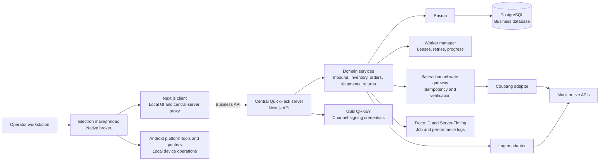
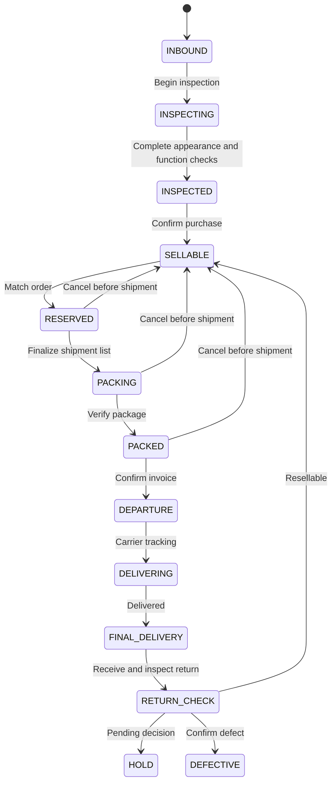
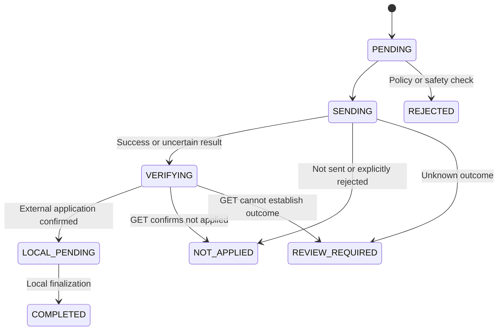

# QuickHack

[한국어](README.md) | **English**

QuickHack is an internal **ERP/WMS that connects each device's inbound plan, inspection, purchase confirmation, inventory, marketplace order allocation, invoicing, delivery, and returns through PG and IMEI identifiers**.

Its core objective is to keep physical device state, the quantity ledger, and external sales-channel state consistent as a device moves through the logistics workflow. PG is the application's device tracking identifier; IMEI identifies the mobile device where available.

## Implemented scope

In addition to inbound, inspection, purchasing, inventory, order, shipment, and return services, the source includes the following capabilities. These describe code boundaries; operational acceptance is listed separately under [Verification and remaining gaps](#verification-and-remaining-gaps).

| Capability | Implementation | Main sources |
| --- | --- | --- |
| Automatic inspection PG issuance | Per-upload-row reservations, request replay, consumption, abandonment, and 24-hour expiration. A PG contains two uppercase letters and ten digits | [pg-issuance-service.ts](quickhack_server/inspection/pg-issuance-service.ts) |
| Manual order matching | Assign, replace, or release a PG for an already collected sales-channel order. STAFF read/preview, MANAGER execution with sensitive-action authentication, and worker follow-up after commit | [manual-order-matches.ts](quickhack_server/api/sales-channel/coupang/manual-order-matches.ts), [service](quickhack_server/sales-channel/coupang/manual-order-match-service.ts) |
| Korean and English UI | `ko`/`en` catalogs, persisted and synchronized user locale, and API message ownership contracts | [locales.ts](quickhack_shared/i18n/locales.ts), [catalogs](quickhack_client/i18n/catalogs) |
| Electron client | Main/preload, local client runtime, native broker, output and ADB windows, notifications, and update state handling | [quickhack_desktop](quickhack_desktop) |
| Database baseline | A single initial migration with applied-history, SQL checksum, and active-PG partial-index validation | [schema contract](quickhack_shared/core/postgresql-schema-contract.mjs) |

The Electron update coordinator currently uses `unavailablePackageUpdateAdapter`; an automatic update delivery backend is not connected. Passing locale contracts also does not establish translation acceptance for every native screen.

## The logistics problem

Several teams and systems handle the same physical device. Keeping inbound records, inspection results, purchase prices, inventory, orders, invoices, and returns separately creates recurring risks:

- A sellable device can be allocated to two orders.
- Current stock may be visible without an explanation of which operations changed it.
- An external API may apply a request while its response is lost, making a blind retry duplicate the operation.
- Inspection, inventory, shipment, and return screens may implement conflicting state changes.
- Operators may not know whether to retry or first inspect the external system.

### Recorded incidents

These incidents were recorded in the preceding Google Sheets-based operation. Unconfirmed causes and loss estimates are not inferred. Detailed internal incident records are not included in this public repository. Statuses below describe those recorded incidents, not newly verified operational conditions.

| ID | Date | Incident | Impact | Recorded status |
| --- | --- | --- | --- | --- |
| #001 | 2026-06-25 | Duplicate Coupang Wing invoice printing and shifted sequence numbers | Manual re-entry; approximately 30-minute delay | Addressed |
| #002 | 2026-06-24 | All sheets stopped working | Approximately 10-minute interruption | Recovered |
| #003 | 2026-06-25 | An operator's filter settings confused other workers | Approximately 5-minute delay | Addressed |
| #004 | 2026-07-03 | One order-matching record was deleted | Discovered during shipment; approximately 10-minute delay | Recovery requested |
| #005 | 2026-07-06 | Multiple order-matching records failed to synchronize | Risk of omitted shipments | Cause unconfirmed |
| #006 | 2026-07-10 | Inventory lookup omitted records | Risk of prolonged failure to detect loss or theft | Cause unconfirmed |
| #007 | 2026-07-13 | Incorrect storage capacity registered for inventory | Incorrect stock data and matching risk | Correction needed |
| #008 | 2026-07-14 | An inspected and purchased device was absent from inventory | System and physical stock diverged | Found during stocktake |
| #009 | 2026-07-14 | QUERY output showed inventory absent from the source | Nonexistent inventory appeared | Further investigation needed |
| #010 | 2026-07-16 | Inventory changed to “order confirmed” without an order | Two order/inventory inconsistencies | Further investigation needed |
| #011 | From 2026-07-20 | Coupang Item Winner caused option/matching confusion | Repeated ambiguity and wrong-shipment risk | Ongoing in the incident record |
| #012 | 2026-07-22 | The confusion in #011 caused an actual wrong shipment | Recalled before customer delivery | Customer impact prevented |
| #013 | 2026-07-23 | The same confusion recurred | Risk persisted the day after the wrong shipment | Recurrence |

Documented delays total at least **55 minutes**. Investigation, reconciliation, and rework time for later incidents was not measured and is excluded.

| Recurring pattern | Incidents | Required control |
| --- | --- | --- |
| Expected data disappears or is not applied | #004, #005, #006, #008 | Preserve source history, record synchronization outcomes, reconcile inventory |
| Unexpected data or states appear | #009, #010 | Validate state-transition evidence and compare the ledger with current values |
| Orders, inventory, or options are linked incorrectly | #001, #007, #011, #012, #013 | Idempotency, internal SKU normalization, shipment mismatch blocking |
| The entire workflow becomes unavailable | #002 | Remove the spreadsheet dependency and expose server/backup state |
| One person's view changes affect others | #003 | Independent user settings and query filters |

Several issues were detected through external evidence and manual inspection: earlier print records for #004, separate stocktakes for #008/#009, and a final manual shipment check for #012. The ambiguity in #011 produced #012 and recurred as #013 the following day.

These records motivated the quantity ledger, allowed state transitions, external-write recovery, separation of internal SKUs from marketplace options, and inventory reconciliation.

| Problem | Design principle |
| --- | --- |
| Broken physical-device traceability | Link inbound, inspection, inventory, orders, and returns through the PG in `devices` |
| Only current quantities are available | Separate per-device state from SKU balances; record quantity changes in an append-only ledger |
| Scattered state changes | Use shared inspection, inventory, and shipment transition policies |
| Unknown external-write results | Persist requests, target snapshots, and attempts; verify with GET before local finalization |
| Duplicate work and recovery | Use idempotency keys, worker leases, retry states, and operator review queues |

## Architecture



Source development can run on one computer. Packages separate server and client responsibilities:

- Server: central database, business APIs, workers, and backup tools. Demonstration servers include Mock integrations.
- Client: local UI, ADB, and a central-server proxy.
- Database access, workers, QHKEY, and external API secrets belong to the server, not the client package.

| Path | Responsibility |
| --- | --- |
| `quickhack_client/` | UI, form state, locale catalogs, and local-operation requests |
| `quickhack_desktop/` | Electron main/preload, windows, and native broker |
| `quickhack_android/` | Android device inspection application |
| `app/api/` | Next.js route wrappers |
| `quickhack_server/` | Authorization, transactions, domain services, workers, integrations |
| `quickhack_shared/` | State codes, transition policies, DTOs, and shared utilities |
| `prisma/` | Database schema and migrations |
| `packaging/` | Windows MSIX and CachyOS/Arch packages; demonstration/operational × server/client |
| `tests/` | Static contracts, regression, PostgreSQL/OS integration, and visual checks |

## Database models and state transitions

The current [Prisma schema](prisma/schema.prisma) contains **100 models**. The main consistency boundaries are:

| Models | Purpose |
| --- | --- |
| `devices`, `inbounds`, `inspections`, `inventory` | PG-based device identity, inbound/inspection history, and per-device inventory state |
| `product_criteria_options`, `inventory_skus` | Normalize model, capacity, color, and grade into stable internal SKUs |
| `inventory_quantity_balances`, `inventory_quantity_movements` | Current SKU/state balances and append-only quantity changes |
| `coupang_order_raw`, `order_items`, `match_worker_allocation` | Raw orders, normalized items, and device allocations |
| `shipment_package_groups`, `carrier_shipments`, `sales_records` | Package groups, carrier invoices, and finalized sales |
| `sales_channel_write_requests`, `sales_channel_write_request_targets`, `sales_channel_write_request_attempts` | External requests, immutable targets, and execution/verification/finalization attempts |
| `server_worker_jobs`, `server_job_logs` | Job state, leases, retries, and execution evidence |
| `manual_order_match_selection_receipts`, `manual_order_match_intent_leases` | Candidate-selection evidence and manual-matching priority leases |
| `inspection_pg_reservations` | Upload-row identity and PG reservation/consumption state |
| `desktop_notification_events`, `desktop_notification_recipients`, `user_preferences` | Notification delivery/read state and user locale |

### Inspection and inventory

This is the principal business flow, not an exhaustive list of allowed transitions. Writes follow [inventory-write-rules.ts](quickhack_shared/inventory/inventory-write-rules.ts).



Each quantity movement records `quantity_delta`, before/after quantities, the originating operation, actor or worker, timestamp, and an idempotency key.

```text
new balance = previous balance + quantity_delta
```

`inventory` identifies which physical device is in which state; `inventory_quantity_balances` counts devices in each SKU/state. Updating both in one transaction maintains consistency.

### External writes



## External API recovery

1. Check the environment, global write policy, and endpoint pause state before dispatch.
2. Persist a unique idempotency key and immutable target/business-input snapshots.
3. Record WRITE, VERIFY_READ, and LOCAL_FINALIZE attempts separately.
4. After an ambiguous timeout, disconnection, or 5xx response, inspect the target with GET before repeating the write.
5. Finalize confirmed changes locally; record confirmed non-application as `NOT_APPLIED` and unresolved outcomes as `REVIEW_REQUIRED`.
6. Pause endpoint writes after repeated failures and expose the cause for operator review.
7. Run background work under a database lease; record retryable failures as `RETRY_WAITING` and exhausted retries as `FAILED`.

External secret keys are not delivered to the browser or client package. The server signs requests within the QHKEY credential context and records recovery-relevant states, stages, and error codes instead of raw credentials.

## Three-minute demo

A public demo video has not yet been recorded. The intended walkthrough is:

| Time | Content | Design point |
| --- | --- | --- |
| 0:00–0:20 | Inbound-to-return problem | One PG connects the workflow |
| 0:20–0:50 | Inbound batch and inspections | Separate inputs and inspection history |
| 0:50–1:20 | Purchase confirmation and inventory ledger | Device state and SKU balance update together |
| 1:20–1:55 | Mock order collection and matching | Prevent duplicate allocations; expose failure reasons |
| 1:55–2:30 | Packing/invoicing and injected API failure | Verify with GET rather than retry blindly |
| 2:30–3:00 | Review queue and performance view | Operator intervention and traceability |

A thumbnail and a single video link can be added when the recording is available. The demonstration steps below follow the same workflow.

## Performance evidence

There are no publishable before/after measurements from production traffic. The implementation provides measurement and query controls:

| Earlier limitation | Current mechanism | Inspection point |
| --- | --- | --- |
| Users only observe that a request is slow | Shared browser/server Trace ID | Developer response-performance view |
| Database and transaction costs are indistinguishable | `Server-Timing` for DB totals, longest query, and transaction-entry wait | Network headers and server logs |
| Only individual slow requests are visible | Counts, p50, p95, and slow samples over one second | Performance reports |
| Large lists render increasingly many elements | Virtualized grids | Inventory, order, shipment, and administration lists |
| History reads grow without bounds | Cursor/limit pagination for growing datasets | Quantity movements and shipment history |

These establish observability and query boundaries. Performance improvement claims require repeated measurements using equivalent data and hardware.

## Verification and remaining gaps

### Recheck on 2026-09-09

The reviewed working tree is based on `8b46e12` and includes the baseline squash. These are source-analysis and selected-test results, not a statement about complete operational acceptance or remote CI.

| Check | Result |
| --- | --- |
| Full TypeScript and carrier TypeScript | PASS |
| Full ESLint | PASS — 0 errors, 71 warnings |
| Migration directory and SQL checksum contract | PASS |
| Manual matching scope, candidate selection, and shipment safety | PASS |
| PG issuance regression | PASS |
| Locale contract suite | PASS |
| Electron security contract | PASS |
| Server migration package, platform/package source boundaries, verification graph | PASS |
| Live DB integration, production build, installation, GUI, physical devices, vulnerability lookup | NOT_RUN — outside this static-analysis pass |

The lint warnings comprise 70 unused-variable warnings and one `` warning. A separate temporary PostgreSQL 18.6 run on **2026-09-07** passed schema-dump equivalence between the original eight migrations and the squashed baseline, fresh deployment, audit, repeated deployment, PG reservations, and user-locale persistence. Those are earlier results; DB tests were not rerun in this pass.

### Automated coverage

`npm run verify` runs the PostgreSQL baseline and integration graph, type checks, and standalone build. The graph includes worker leases, inventory ledgers, external-write failure/verification, matching, package groups, returns, invoices, and Logen integration.

The migration tree is a single fresh-database `20260811010000_postgresql_baseline`. Compatibility with pre-squash databases and backups is not supported. The SQL checksum and applied history form the release schema contract.

Tests address duplicate idempotent operations, writes after lease loss, timeout-after-apply recovery, multi-item/partial shipment allocation, invalid inventory transitions, and unsaved form changes. Having a test in the graph does not mean it ran in the current pass.

### Mock and acceptance boundaries

| Area | Source state | Remaining acceptance |
| --- | --- | --- |
| Coupang Open API | Mock is the default integration; supports synthetic orders/returns and timeout, 5xx, malformed JSON injection | Real seller-account GET verification, write-policy controls, vendor response differences |
| Logen Open API | Mock invoice, tracking, return, and failure scenarios | Contract credentials, live authentication, label printers, collection workflow |
| Database | Single-baseline contract PASS; selected DB tests passed on 2026-09-07 | Full DB graph, operational backup/restore, OS services |
| Packaging | Four logical products: demonstration/operational × server/client; eight Windows MSIX and CachyOS/Arch platform variants in source | Actual builds, signing, install/repair/removal, cross-host pairing |
| Installation trust | MSIX signing, candidate verification, and publication gates; Inno Setup remains legacy compatibility source | Signed artifacts and Windows installation trust |
| Electron | Broker, windows, notifications, output paths; update adapter unavailable | Native windows, printers, ADB, notifications, package updates |
| Performance | Trace and p50/p95 instrumentation | Representative-volume baselines and repeated comparisons |

See the [package and release contract](packaging/README-RELEASE.md) for artifact and release boundaries.

## Development and execution

[package.json](package.json) requires **Node.js 24.x and npm 12.x**, with `npm@12.0.2` selected. Servers need PostgreSQL 18, server-owned configuration, and role-specific credentials. ADB, printers, and QHKEY are needed for their respective features.

### Prepare the source

These commands work in Bash and PowerShell:

```sh
git clone https://github.com/msang710/QuickHack_Public_Portfolio.git
cd QuickHack_Public_Portfolio
npm ci
```

The `npm ci` postinstall generates the Prisma client. [Prisma configuration](prisma.config.ts) uses the server-owned credential resolver, so server configuration and activation credentials may need preparation in the current environment. Installing dependencies does not provision the database, accounts, or Mocks.

### Server configuration and accounts

1. Follow the [package/release contract](packaging/README-RELEASE.md) for server installation, Setup, and role-specific storage. The source console reads `config/server-console.local.json`; explicit configuration is selected with `--runtime-config`.
2. Once PostgreSQL, roles such as migrator/runtime, and protected credentials are ready, use `npm run db:init` to apply the fresh baseline. This command does not install PostgreSQL or provision accounts.
3. Initial administrator creation belongs to [provision-initial-leader.mjs](tools/provision-initial-leader.mjs) and server Setup. A shared developer login/password and a `prisma:seed:test-users` script are not part of the current execution contract.

There is no compatibility path for applying this squashed baseline directly to pre-squash databases or backups.

### Run a prepared environment

| Command | Purpose |
| --- | --- |
| `npm run server:console` | Server console; default ports: console 2999, backend 3000, HTTPS gateway 3443 |
| `npm run dev` | Next.js development server |
| `npm run mock:coupang` / `npm run mock:logen` | Start Mocks in a configured demonstration environment |
| `npm run build:electron` | Bundle Electron main/preload |
| `npm run desktop` | Build and launch Electron; requires local client-runtime and central-server configuration |

Do not start the standalone development server and console-managed backend on the same port. Electron's default client origin is `http://127.0.0.1:3001`, with a different role from the server on port 3000. These commands are not a guarantee of a zero-configuration, fresh-clone login demo.

### Verification commands

Core checks that do not use a database:

```sh
npm run typecheck -- --incremental false
npm run typecheck:carrier -- --incremental false
npm run lint
npm run test:postgresql-schema-contract
npm run test:manual-order-match-contract
npm run test:inspection-pg-issuance
npm run test:i18n-contracts
npm run test:electron-security
npm run test:server-migration-runtime-package
```

For the full verification graph:

```sh
npm run verify
```

PostgreSQL integration tests require `QUICKHACK_TEST_ADMIN_DATABASE_URL` or `QUICKHACK_TEST_DATABASE_URL` with permission to create isolated test schemas. Do not point tests at an operational database. See [tests/README.md](tests/README.md) for test organization and platform scope.

### Demo walkthrough

1. Register an inbound batch and appearance/function inspections; inspect PG reservation and history linkage.
2. Confirm purchase and compare per-device state with SKU quantity movements.
3. Configure internal SKUs and marketplace mappings, then collect Mock orders.
4. Inspect automatic matching, followed by manual assign/replace/release previews and authorization checks.
5. Process packing/invoices, inject a Mock timeout/503, and inspect the review queue, job logs, and response performance.
6. Separately check Korean/English switching, persisted preferences, and Electron output, ADB, and notifications.
