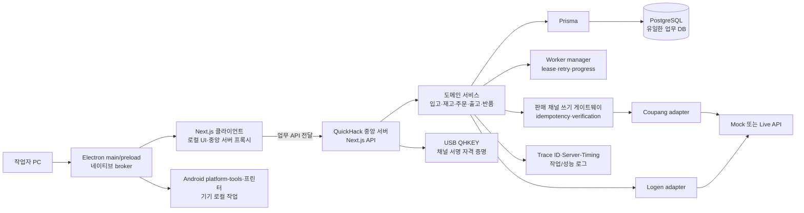
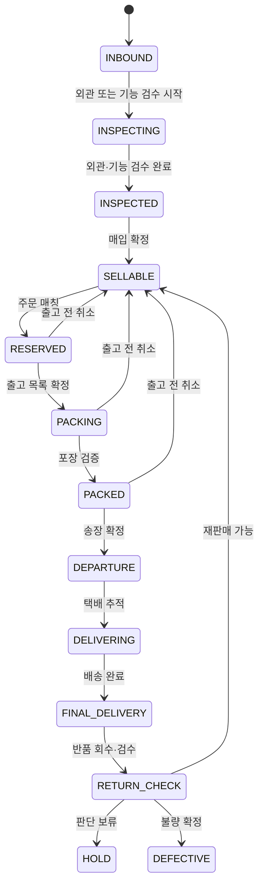
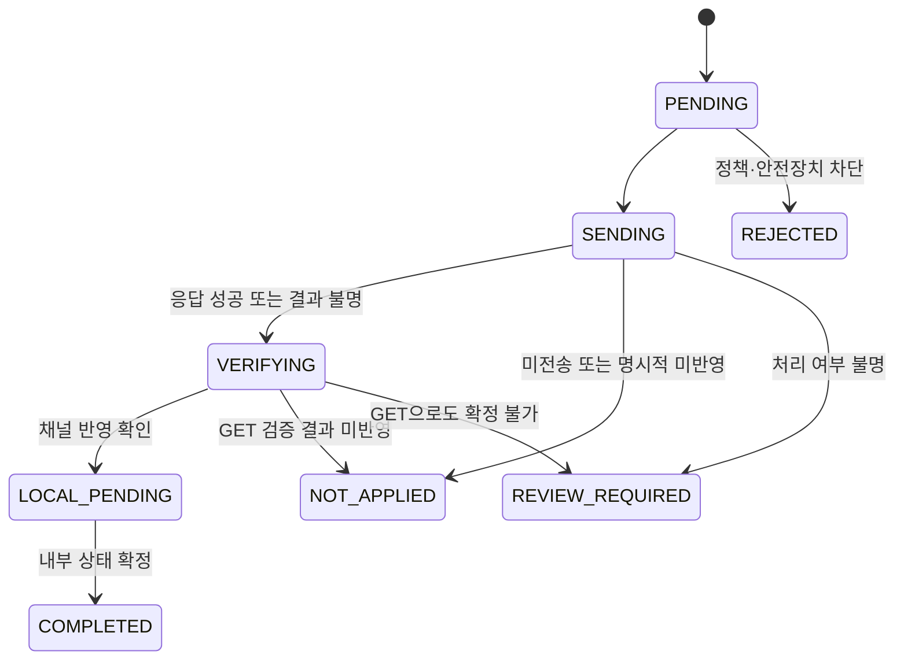

# QuickHack

**한국어** | [English](README.en.md)

QuickHack은 기기 한 대의 입고 예정부터 검수, 매입 확정, 재고, 판매 채널 주문 매칭, 송장, 배송, 반품까지를 **PG·IMEI 단위로 연결하는 사내용 ERP/WMS**입니다.

핵심 목표는 화면 수를 늘리는 것이 아니라, 물류 단계가 바뀔 때마다 **실물 기기 상태, 수량 원장, 외부 채널 상태가 서로 어긋나지 않도록 만드는 것**입니다.

## 현재 구현 범위

입고·검수·매입·재고·주문·출고·반품 서비스 외에 다음 기능이 소스에 구현되어 있습니다. 아래 설명은 기능의 코드 경계이며 실제 운영 수용 여부는 [검증 범위](#검증-범위와-아직-mock인-범위)에서 구분합니다.

| 기능 | 구현 내용 | 주요 소스 |
| --- | --- | --- |
| 검수 PG 자동 발급 | 업로드 행별 PG 예약, 동일 요청 재실행, 소비·포기·24시간 만료. PG는 영문 대문자 2자와 숫자 10자로 구성 | [pg-issuance-service.ts](quickhack_server/inspection/pg-issuance-service.ts) |
| 수동 주문 매칭 | 이미 수집된 판매 채널 주문의 PG 배정·교체·해제. STAFF 조회/미리보기, MANAGER 실행 및 민감 작업 인증. 커밋 이후 후속 worker 처리 | [manual-order-matches.ts](quickhack_server/api/sales-channel/coupang/manual-order-matches.ts), [service](quickhack_server/sales-channel/coupang/manual-order-match-service.ts) |
| 한국어·영어 UI | `ko`·`en` 카탈로그, 사용자 언어 저장·동기화, API 메시지 소유권 계약 | [locales.ts](quickhack_shared/i18n/locales.ts), [catalogs](quickhack_client/i18n/catalogs) |
| Electron 클라이언트 | main/preload, 로컬 클라이언트 runtime, 네이티브 broker, 출력·ADB 창, 알림 및 업데이트 상태 처리 | [quickhack_desktop](quickhack_desktop) |
| DB baseline | 전체 초기 스키마를 단일 마이그레이션으로 생성하고 적용 이력·SQL 체크섬·활성 PG 부분 인덱스를 검증 | [schema contract](quickhack_shared/core/postgresql-schema-contract.mjs) |

Electron 업데이트 조정기는 현재 `unavailablePackageUpdateAdapter`를 사용합니다. 자동 업데이트 배포가 연결되었다는 의미는 아닙니다. 한국어·영어 계약 검사 역시 모든 네이티브 화면의 번역 수용을 보장하지 않습니다.

## 해결하려는 물류 문제

기기 단위 물류에서는 같은 실물을 여러 팀과 시스템이 차례로 다룹니다. 입고표, 검수 결과, 매입가, 현재 재고, 판매 채널 주문, 송장과 반품 정보가 따로 관리되면 다음 문제가 생깁니다.

- 판매 가능한 한 대가 두 주문에 동시에 배정될 수 있습니다.
- 현재 수량은 보여도 언제, 어떤 업무 때문에 수량이 달라졌는지 설명하기 어렵습니다.
- 외부 API 요청은 반영됐지만 응답만 유실된 경우, 단순 재시도가 중복 처리로 이어질 수 있습니다.
- 검수·매입·출고·반품의 상태 변경이 메뉴별 예외 처리로 흩어지면 서로 모순된 상태가 만들어집니다.
- 장애가 발생했을 때 담당자가 “다시 눌러도 되는 실패”와 “먼저 외부 상태를 확인해야 하는 실패”를 구분하기 어렵습니다.

### 실제 장애 이력

다음은 기존 구글 시트 중심 물류 운영에서 직접 기록한 장애입니다. 상세 원인이나 피해 규모가 확인되지 않은 사건은 임의로 단정하지 않았습니다. 사건별 발생 내용, 발견 과정, 조치와 위험성을 담은 전체 기록은 내부 자료로만 보존하고 공개 저장소에는 포함하지 않습니다.

| 번호 | 발생일 | 장애 내용 | 주요 영향 | 상태 |
| ---: | :---: | --- | --- | --- |
| #001 | 2026-06-25 | 쿠팡 윙 송장 중복 출력 및 순번 밀림 | 수동 재등록, 약 30분 지연 | 조치 완료 |
| #002 | 2026-06-24 | 전체 시트 작동 정지 | 모든 시트 업무 약 10분 중단 | 복구됨 |
| #003 | 2026-06-25 | 작업자 필터 설정으로 업무 혼선 | 약 5분 지연 | 조치 완료 |
| #004 | 2026-07-03 | 주문 매칭 데이터 1건 삭제 | 출고 중 발견, 약 10분 지연 | 복구 요청 |
| #005 | 2026-07-06 | 주문 매칭 데이터 다수 동기화 누락 | 출고 대상 누락 위험 | 원인 미확인 |
| #006 | 2026-07-10 | 재고실사용 시트 조회 누락 | 분실·도난을 장기간 인지하지 못할 위험 | 원인 미확인 |
| #007 | 2026-07-13 | 재고 용량 오등록 | 재고 정보 오류와 오매칭 위험 | 수정 필요 |
| #008 | 2026-07-14 | 검수·매입 완료 기기 재고 등록 누락 | 시스템 재고와 실재고 불일치 | 재고조사 중 발견 |
| #009 | 2026-07-14 | 원본에 없는 재고가 QUERY 결과에 표시 | 존재하지 않는 재고 표시 | 추가 조사 필요 |
| #010 | 2026-07-16 | 주문 없이 재고 상태가 ‘주문 확인’으로 변경 | 주문과 재고 상태 불일치 2건 | 추가 조사 필요 |
| #011 | 2026-07-20부터 지속 | 쿠팡 아이템위너로 인한 옵션·매칭 혼선 | 지속적인 판단 혼선과 오출고 위험 | 지속 발생 |
| #012 | 2026-07-22 | #011로 인해 실제 오출고 발생 | 고객 전달 직전 회수 | 고객 피해 방지 |
| #013 | 2026-07-23 | #011과 동일한 혼선 재발 | 실제 오출고 다음 날에도 동일 위험 지속 | 재발 |

확인된 업무 지연만 최소 **55분**입니다. #005 이후 사건의 조사·대조·재작업 시간은 확인되지 않아 포함하지 않았습니다.

| 반복 패턴 | 관련 장애 | QuickHack에서 요구된 통제 |
| --- | --- | --- |
| 있어야 할 데이터가 사라지거나 반영되지 않음 | #004, #005, #006, #008 | 원본 이력 보존, 동기화 결과 기록, 재고 대사 |
| 없어야 할 데이터나 상태가 나타남 | #009, #010 | 상태 전이의 근거 검증, 원장과 현재값 교차 확인 |
| 다른 주문·재고·옵션과 잘못 연결됨 | #001, #007, #011, #012, #013 | idempotency, 내부 SKU 정규화, 출고 전 불일치 차단 |
| 업무 기반 전체를 사용할 수 없음 | #002 | 시트 단일 장애점 제거와 서버 상태·백업 가시성 |
| 한 작업자의 화면 조작이 다른 작업자에게 영향 | #003 | 사용자별 화면 상태와 독립된 조회 조건 |

여러 사건은 정상 업무 흐름이 아니라 외부 증거와 수동 점검으로 발견됐습니다. #004는 과거 프린트 기록, #008과 #009는 별도 재고조사, #012는 출고 마감 단계의 수동 검수가 마지막 방어선이었습니다. 특히 #011의 구조적 혼선이 #012의 실제 오출고로 이어졌고, 다음 날 #013으로 재발했습니다.

QuickHack의 수량 원장, 허용된 상태 전이, 외부 쓰기 복구, 내부 SKU와 채널 옵션의 분리, 재고 대사 기능은 이 운영 기록에서 출발했습니다.

QuickHack은 이 문제를 다음 원칙으로 풉니다.

| 문제 | 설계 원칙 |
| --- | --- |
| 실물 추적 단절 | `devices`의 PG를 중심으로 입고·검수·재고·주문·반품 이력을 연결 |
| 현재 수량만 존재 | 기기별 현재 상태와 SKU별 수량 잔액을 분리하고, 모든 증감을 append-only 원장에 기록 |
| 상태 변경 규칙 분산 | 검수·재고·출고 상태 전이를 공유 정책으로 제한 |
| 외부 쓰기 결과 불명 | 요청·대상 스냅샷·시도 이력을 저장하고 GET 검증 후 내부 상태를 확정 |
| 중복 작업과 장애 복구 | idempotency key, worker lease, 재시도 상태, 수동 확인 대기열을 사용 |

## 전체 아키텍처



소스 개발 모드는 한 PC에서 실행할 수 있고, 배포 패키지는 역할을 분리합니다.

- 서버 패키지: 중앙 DB, 업무 API, worker, 백업 도구. 데모 서버는 Mock 연동을 포함합니다.
- 클라이언트 패키지: 로컬 UI, ADB, 중앙 서버 프록시
- 클라이언트에는 DB, worker, QHKEY, 외부 API Secret을 포함하지 않습니다.

코드 경계도 같은 책임 분리를 따릅니다.

| 경로 | 책임 |
| --- | --- |
| `quickhack_client/` | 화면, 폼 상태, 다국어 카탈로그, 로컬 작업 요청 |
| `quickhack_desktop/` | Electron main/preload, 창 관리, 네이티브 broker |
| `quickhack_android/` | Android 기기 검사 애플리케이션 |
| `app/api/` | Next.js route wrapper |
| `quickhack_server/` | 권한 검사, 트랜잭션, 도메인 서비스, worker, 외부 연동 |
| `quickhack_shared/` | 상태 코드, 전이 정책, DTO, 순수 유틸리티 |
| `prisma/` | 현재 DB 스키마와 마이그레이션의 단일 기준 |
| `packaging/` | Windows MSIX·CachyOS/Arch, 데모/운영 × 서버/클라이언트 패키징 |
| `tests/` | 정적 계약, 회귀, PostgreSQL·OS 통합, 시각 검증 |

## 핵심 DB 모델과 상태 전이

현재 [Prisma 스키마](prisma/schema.prisma)의 100개 모델 전체를 나열하는 대신, 물류 정합성을 만드는 핵심 묶음만 표시합니다.

| 모델 묶음 | 역할 |
| --- | --- |
| `devices` · `inbounds` · `inspections` · `inventory` | PG 기준 실물 마스터, 입고·검수 이력, 기기별 현재 재고 상태 |
| `product_criteria_options` · `inventory_skus` | 모델·용량·색상·판매등급을 안정적인 내부 SKU로 정규화 |
| `inventory_quantity_balances` · `inventory_quantity_movements` | SKU·상태별 현재 수량과 append-only 증감 원장 |
| `coupang_order_raw` · `order_items` · `match_worker_allocation` | 원본 주문 보존, 정규화된 주문 품목, 기기 배정 결과 |
| `shipment_package_groups` · `carrier_shipments` · `sales_records` | 묶음 배송, 택배 송장, 판매 확정 이력 |
| `sales_channel_write_requests` · `sales_channel_write_request_targets` · `sales_channel_write_request_attempts` | 외부 쓰기 요청, 불변 대상 스냅샷, 실행·검증·내부 확정 시도 |
| `server_worker_jobs` · `server_job_logs` | 작업 상태·lease·재시도와 실행 결과 이력 |
| `manual_order_match_selection_receipts` · `manual_order_match_intent_leases` | 후보 선택 증거와 수동 매칭 우선권 lease |
| `inspection_pg_reservations` | 검수 행과 PG 예약·소비 상태 연결 |
| `desktop_notification_events` · `desktop_notification_recipients` · `user_preferences` | 알림 수신/읽음 상태와 사용자별 언어 설정 |

### 검수와 재고 상태

다음은 업무 관점의 주 경로입니다. 실제 변경은 `quickhack_shared/inventory/inventory-write-rules.ts`의 전이 정책을 통과해야 합니다.



수량 원장은 현재 잔액만 덮어쓰지 않습니다. 각 movement에는 `quantity_delta`, 변경 전·후 수량, 원인 업무, 작업자 또는 worker, 발생 시각과 고유 idempotency key가 남습니다.

```text
새 잔액 = 이전 잔액 + quantity_delta
```

기기별 `inventory`는 “어떤 실물이 어느 상태인가”를, `inventory_quantity_balances`는 “같은 SKU·상태가 몇 대인가”를 답합니다. 두 관점을 분리하되 한 트랜잭션에서 함께 갱신하는 것이 원장 정합성의 핵심입니다.

### 외부 채널 쓰기 상태



## 외부 API 실패 복구 원칙

외부 쓰기는 “오류가 나면 같은 요청을 다시 보낸다”로 처리하지 않습니다.

1. **쓰기 전 차단** — 실행 환경, 전역 쓰기 정책, endpoint pause 상태를 확인합니다.
2. **중복 방지** — 요청의 idempotency key를 유일하게 저장하고, 대상과 업무 입력값을 불변 스냅샷으로 남깁니다.
3. **시도 기록** — WRITE, VERIFY_READ, LOCAL_FINALIZE를 별도 attempt로 누적합니다.
4. **결과 불명 시 조회 우선** — timeout, 네트워크 단절, 5xx처럼 외부 반영 여부가 모호하면 같은 쓰기를 즉시 재전송하지 않고 대상 상태를 GET으로 검증합니다.
5. **결과별 분기** — 반영 확인은 내부 확정으로, 미반영 확인은 `NOT_APPLIED`로, 끝내 알 수 없는 결과는 `REVIEW_REQUIRED`로 보냅니다.
6. **장애 확산 방지** — 연속된 외부 장애는 endpoint 쓰기를 일시 정지하고 운영자가 원인과 마지막 실패를 확인한 뒤 재개합니다.
7. **백그라운드 복구** — 읽기 동기화와 배치 작업은 DB lease를 획득한 worker만 실행하며, 실패 시 `RETRY_WAITING`, 재시도 한도 초과 시 `FAILED`로 남깁니다.

Secret Key는 브라우저나 클라이언트 패키지에 전달하지 않습니다. 서버가 QHKEY 자격 증명 컨텍스트 안에서 요청을 서명하고, 자격 증명 원문 대신 복구 판단에 필요한 요청 상태·실패 단계·오류 코드를 기록합니다.

## 3분 데모 영상

> 공개 가능한 데모 영상은 아직 촬영되지 않았습니다. 존재하지 않는 링크를 넣는 대신, 아래 시나리오를 3분 영상의 촬영 기준으로 고정합니다.

| 구간 | 보여줄 내용 | 확인할 설계 포인트 |
| --- | --- | --- |
| 0:00–0:20 | 기기 입고부터 반품까지의 문제 정의 | PG 한 개가 전체 흐름의 기준 |
| 0:20–0:50 | 입고 차수와 외관·기능 검수 | 단계별 입력과 검수 이력 분리 |
| 0:50–1:20 | 매입 확정 후 재고 조회·수량 원장 | 기기 상태와 SKU 잔액 동시 반영 |
| 1:20–1:55 | Mock 주문 수집과 재고 자동 매칭 | 중복 배정 방지와 실패 사유 |
| 1:55–2:30 | 포장·송장 처리와 외부 쓰기 실패 주입 | blind retry 대신 GET 검증 |
| 2:30–3:00 | 처리 확인 대기열과 응답 성능 화면 | 사람이 개입할 경계와 추적 가능성 |

영상 공개 시 이 섹션 상단에 썸네일과 단일 링크를 추가하고, 아래의 실행 절차는 영상과 같은 순서로 유지합니다.

## 성능 개선 전후

현재 공개 가능한 운영 트래픽 기준의 전후 수치는 없습니다. 따라서 근거 없는 “몇 % 개선”을 적지 않고, 먼저 병목을 재현하고 설명할 수 있게 만든 변화를 기록합니다.

| 이전 | 현재 | 확인 방법 |
| --- | --- | --- |
| 사용자는 요청이 느리다는 결과만 인지 | 브라우저와 서버가 같은 Trace ID를 사용 | 개발자 메뉴의 응답 성능 상세 |
| 전체 응답 시간 안에서 DB와 트랜잭션 비용을 분리하기 어려움 | `Server-Timing`에 DB 합계·최장 쿼리·트랜잭션 진입 대기·실행 시간을 기록 | 브라우저 네트워크 패널과 서버 작업 로그 |
| 개별 느린 요청 위주로 확인 | 작업별 표본 수, p50, p95, 1초 이상 slow sample을 집계 | 응답 성능 리포트 |
| 대량 목록에서 렌더링 대상이 함께 증가 | 주요 업무 목록에 가상화된 데이터 그리드 적용 | 재고·주문·반품·관리 목록 스크롤 |
| 긴 이력 조회가 한 요청에 커질 수 있음 | 수량 원장과 송장 이력 등 고증가 데이터에 cursor·limit 적용 | 다음 페이지 연속 조회 |

이 단계의 성과는 **측정 체계와 확장 경로를 확보한 것**입니다. 실제 배포 환경의 동일 fixture·동일 장비 반복 측정이 끝난 뒤에만 절대 시간과 개선율을 이 표에 추가합니다.

## 검증 범위와 아직 Mock인 범위

### 2026-09-09 재검사 결과

기준은 `8b46e12` 위의 baseline 스쿼시를 포함한 작업 트리입니다. 아래 결과는 소스 분석과 선택 검사이며, 전체 운영 검증이나 원격 CI 상태를 뜻하지 않습니다.

| 검사 | 결과 |
| --- | --- |
| 전체 TypeScript 및 carrier TypeScript | PASS |
| 전체 ESLint | PASS — 오류 0건, 경고 71건 |
| 마이그레이션 디렉터리·SQL 체크섬 계약 | PASS |
| 수동 매칭 범위·후보 선택/배송 안전성 검사 | PASS |
| PG 발급 회귀 검사 | PASS |
| 다국어 계약 묶음 | PASS |
| Electron 보안 계약 | PASS |
| 서버 migration 패키지·플랫폼/패키지 소스 경계·검증 그래프 | PASS |
| 실제 DB 통합·production build·설치·GUI·실기기·취약점 조회 | NOT_RUN — 이번 정적 분석 범위 밖 |

ESLint 경고는 미사용 변수 70건과 `` 관련 1건입니다. 2026-09-07의 별도 임시 PostgreSQL 18.6 검증에서는 기존 8개와 단일 baseline의 스키마 덤프 동등성, 새 DB 적용·audit·반복 배포, PG 예약 및 사용자 언어 저장이 통과했습니다. 이는 당시 검증 결과이며 이번에 다시 실행한 DB 검사는 아닙니다.

### 자동 검증 범위

`npm run verify`는 PostgreSQL clean baseline, 실제 DB 통합 테스트, worker lease, 재고 수량 원장, 외부 쓰기 실패·검증, 주문 매칭, 묶음 배송, 반품, 송장, 로젠 연동 계약과 standalone build를 한 번에 실행합니다.

현재 마이그레이션은 새 DB용 단일 `20260811010000_postgresql_baseline`으로 통합되어 있습니다. 스쿼시 이전 DB·백업과의 호환성은 지원하지 않으며, baseline의 SQL 체크섬과 적용 이력을 릴리스 계약으로 검증합니다.

특히 다음 불변 조건을 독립 테스트로 다룹니다.

- 같은 idempotency key로 수량 movement 또는 외부 쓰기 요청이 중복 생성되지 않는가
- worker lease를 잃은 실행이 이후 상태를 덮어쓰지 않는가
- timeout-after-apply 상황에서 쓰기를 반복하지 않고 대상 조회로 확정하는가
- 다중 상품·분할 배송에서도 주문 품목과 실물 기기 배정이 보존되는가
- 출고·반품·송장 단계가 허용되지 않은 재고 상태 전이를 만들지 않는가
- 저장하지 않은 폼 변경이 메뉴 이동으로 유실되지 않는가

### 아직 Mock 또는 미완료인 범위

| 범위 | 현재 상태 | 실제 운영 전 필요한 검증 |
| --- | --- | --- |
| Coupang Open API | Mock이 기본값이며 주문·반품 생성, timeout, 5xx, malformed JSON 실패 주입 지원 | 실제 판매자 계정의 GET 검증, 판매채널 WRITE 토글 기반 쓰기, 벤더 응답 차이 확인 |
| 로젠택배 Open API | Mock으로 송장·추적·반품과 실패 응답 검증 | 계약 고객 코드, 운영 인증, 실제 라벨 프린터·집하 흐름 검증 |
| 데이터베이스 | 단일 baseline 계약 PASS, 선택 DB 검사는 2026-09-07 통과 | 전체 DB 그래프, 운영 백업·복구 및 OS 서비스 수용 |
| 배포 | 데모/운영 × 서버/클라이언트 4개 논리 제품, Windows MSIX·CachyOS/Arch 8개 플랫폼 변형의 소스 존재 | 실제 패키지 생성·서명·설치·수리·제거·교차 호스트 연결 검증 |
| 설치 신뢰 | MSIX 서명·후보 검증·공개 릴리스 gate 구현. Inno Setup은 이전 호환용 소스 | 실제 서명 산출물과 Windows 설치 신뢰 검증 |
| Electron | 네이티브 broker·창·알림·출력 경로 구현, 업데이트 adapter는 unavailable | 실제 창·프린터·ADB·알림 및 패키지 업데이트 수용 |
| 성능 수치 | Trace·p50·p95 측정 기능 구현 | 운영과 같은 데이터 규모의 기준선·전후 반복 측정 |

데모 패키지와 운영 패키지의 경계는 [`packaging/README-RELEASE.md`](packaging/README-RELEASE.md)에 별도로 기록합니다.

## 개발 환경과 실행

[package.json](package.json)은 **Node.js 24.x, npm 12.x**를 요구하며 `npm@12.0.2`를 지정합니다. 서버는 PostgreSQL 18과 서버 소유 설정·역할별 자격증명이 필요합니다. ADB·프린터·QHKEY는 해당 기능을 검증할 때 준비합니다.

### 소스 준비

Bash와 PowerShell에서 동일하게 사용할 수 있는 명령입니다.

```sh
git clone https://github.com/msang710/QuickHack_Public_Portfolio.git
cd QuickHack_Public_Portfolio
npm ci
```

`npm ci`의 postinstall은 Prisma client를 생성합니다. [Prisma 설정](prisma.config.ts)은 서버 소유 자격증명 resolver를 사용하므로 현재 환경의 서버 설정·활성화 자격증명 상태에 따라 준비가 필요합니다. 의존성 설치만으로 DB·계정·Mock이 준비되지는 않습니다.

### 서버 설정과 계정

1. 서버 패키지 설치/Setup과 역할별 저장 경로는 [패키지·릴리스 계약](packaging/README-RELEASE.md)을 따릅니다. 소스 콘솔은 `config/server-console.local.json`, 명시적 구성은 `--runtime-config`로 읽습니다.
2. PostgreSQL과 migrator/runtime 등 필요한 역할·보호된 자격증명이 준비된 후 `npm run db:init`으로 새 baseline을 적용합니다. 이 명령은 PostgreSQL 설치나 계정 프로비저닝을 대신하지 않습니다.
3. 최초 관리자 생성은 [provision-initial-leader.mjs](tools/provision-initial-leader.mjs)와 서버 Setup 경로가 담당합니다. 공통 개발자 ID/비밀번호나 `prisma:seed:test-users` 명령은 현재 실행 계약에 없습니다.

기존 DB·백업을 스쿼시된 baseline에 그대로 적용하는 호환 경로는 지원하지 않습니다.

### 준비된 환경에서 실행

| 명령 | 용도 |
| --- | --- |
| `npm run server:console` | 서버 콘솔. 기본 콘솔 포트 2999, backend 3000, HTTPS gateway 3443 |
| `npm run dev` | Next.js 개발 서버 |
| `npm run mock:coupang` / `npm run mock:logen` | 설정된 데모 환경의 Mock 실행 |
| `npm run build:electron` | Electron main/preload 번들 생성 |
| `npm run desktop` | Electron 번들 생성 후 실행. 로컬 클라이언트 runtime·중앙 서버 설정 필요 |

단독 개발 서버와 콘솔이 관리하는 backend를 같은 포트에서 동시에 실행하지 않습니다. Electron의 클라이언트 기본 origin은 `http://127.0.0.1:3001`이며 서버의 3000번 포트와 역할이 다릅니다. 명령의 존재는 새 clone에서 로그인까지 자동 완성되는 데모를 보장하지 않습니다.

### 검증 명령

DB를 사용하지 않는 주요 검사:

```sh
npm run typecheck -- --incremental false
npm run typecheck:carrier -- --incremental false
npm run lint
npm run test:postgresql-schema-contract
npm run test:manual-order-match-contract
npm run test:inspection-pg-issuance
npm run test:i18n-contracts
npm run test:electron-security
npm run test:server-migration-runtime-package
```

전체 검증은 다음 명령을 사용합니다.

```sh
npm run verify
```

PostgreSQL 통합 테스트에는 격리 테스트 스키마를 생성할 수 있는 `QUICKHACK_TEST_ADMIN_DATABASE_URL` 또는 `QUICKHACK_TEST_DATABASE_URL`이 필요합니다. 운영 DB를 테스트 대상으로 지정하지 않습니다. 테스트 구조와 플랫폼별 범위는 [tests/README.md](tests/README.md)에 설명되어 있습니다.

### 데모 확인 순서

1. 입고 차수와 외관·기능 검수를 등록하고 PG 예약·검수 이력 연결을 확인합니다.
2. 매입 확정 후 기기별 재고 상태와 SKU 수량 원장을 비교합니다.
3. 내부 SKU와 판매 채널 상품 매핑을 설정하고 Mock 주문을 수집합니다.
4. 자동 매칭 결과를 확인하고 수동 PG 배정·교체·해제의 미리보기와 권한 검사를 확인합니다.
5. 포장·송장 처리 후 Mock timeout/503을 주입하고 처리 확인·서버 작업 로그·응답 성능에서 복구 경로를 확인합니다.
6. 한국어·영어 전환과 사용자 설정 저장, Electron 출력·ADB·알림 경로를 별도로 확인합니다.
